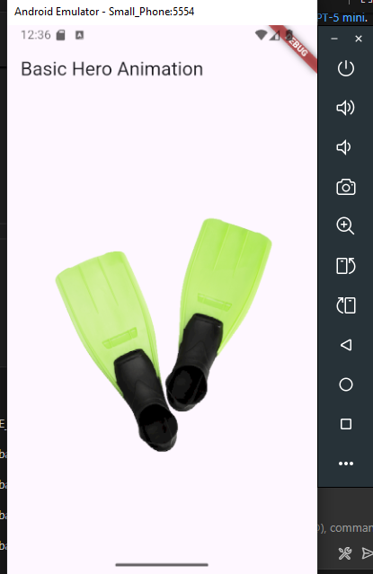
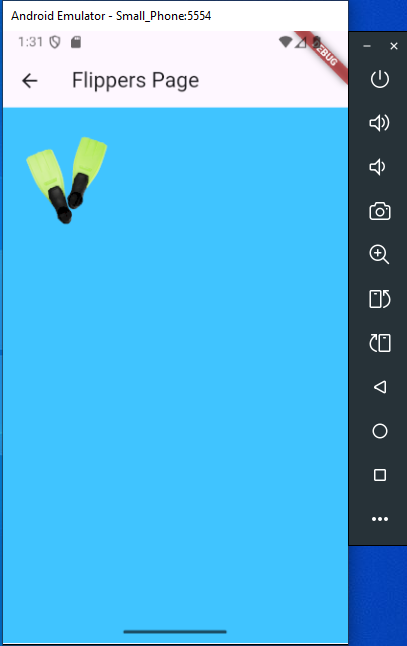

# Hero Animation Demo

A Flutter widget demonstrating hero animations between two screens with interactive image transitions.

## Run Instructions

1. Ensure you have Flutter installed and set up
2. Place an image named `flippers-alpha.png` in your project's `images/` directory
3. Run `flutter pub get`
4. Execute `flutter run`

## Hero Attributes

- **tag**: Unique identifier linking hero widgets across routes
- **child**: The widget to animate between screens (typically an image)
- **flightShuttleBuilder**: Optional custom transition behavior

## Final UI Demonstration

## Demo

### Main Screen

### After Transition

*Tap the image to see the hero animation transition to the detail screen, then tap the smaller image or use the back button to return.*
